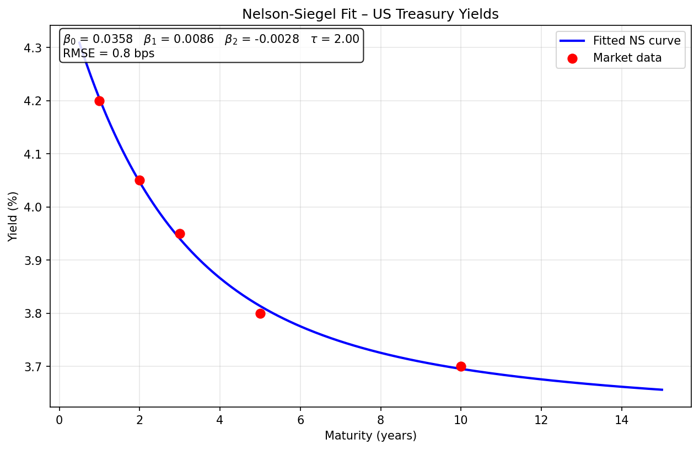
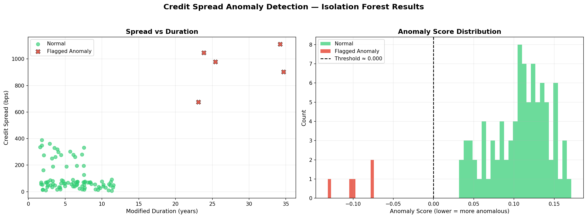

# Fixed-Income & Credit Pricing Analytics Engine

**A quantitative toolkit designed for Debt Capital Markets (DCM) origination and pricing, featuring corporate credit stress testing, sovereign yield curve fitting, and ML-based relative value anomaly detection.**

---

## Table of Contents

- [1. Architecture Overview](#1-architecture-overview)
- [2. Core Modules](#2-core-modules)
  - [2.1 Credit Risk Analyzer](#21-credit-risk-analyzer)
  - [2.2 Nelson-Siegel Yield Curve Fitter](#22-nelson-siegel-yield-curve-fitter)
  - [2.3 Isolation Forest Anomaly Detector](#23-isolation-forest-anomaly-detector)
- [3. Why This Matters for Capital Markets](#3-why-this-matters-for-capital-markets)
- [4. Visualizations](#4-visualizations)
- [5. Getting Started](#5-getting-started)
- [6. Project Structure](#6-project-structure)
- [7. Dependencies](#7-dependencies)

---

## 1. Architecture Overview

The engine is decomposed into three self-contained analytical modules, each addressing a distinct stage of the fixed-income pricing and origination lifecycle:

| Module | File | Role |
|---|---|---|
| **Credit Risk Analyzer** | `src/credit_analysis.py` | Multi-factor corporate credit stress testing and rating-implied spread calibration |
| **Nelson-Siegel Fitter** | `src/yield_curve.py` | Parametric sovereign / risk-free yield curve construction |
| **Isolation Forest Detector** | `src/anomaly_detection.py` | Unsupervised ML-based relative value anomaly screening for credit spreads |

Each module can be executed standalone via its `if __name__ == "__main__":` block, producing both console output and publication-quality charts.

---

## 2. Core Modules

### 2.1 Credit Risk Analyzer

A corporate credit stress-testing engine that models the impact of adverse macro-financial scenarios on issuer credit profiles. Key capabilities include:

- **Rating Transition Matrices** — Historical migration probabilities across the full ratings spectrum (AAA → C).
- **Spread Calibration** — Mapping internal credit scores to observable option-adjusted spreads (OAS).
- **Scenario Analysis** — Stressing leverage, interest coverage, and liquidity ratios under downside assumptions.
- **Loss Given Default** — Estimating recovery-adjusted valuation haircuts for distressed names.

*This module is critical for DCM desks determining fair-value new-issue concessions and for credit research teams validating relative value across sectors.*

### 2.2 Nelson-Siegel Yield Curve Fitter

The `YieldCurveFitter` class implements the classic Nelson-Siegel (1987) parametric model to construct a smooth zero-coupon yield curve from discrete market observations.

**Model Specification:**

The spot rate for maturity `t` is given by:

```
y(t) = β₀
     + β₁ × (1 − e^(−t/τ)) / (t/τ)
     + β₂ × [(1 − e^(−t/τ)) / (t/τ) − e^(−t/τ)]
```

Where:

| Parameter | Economic Interpretation |
|---|---|
| `β₀` | Long-run level of interest rates (the asymptote) |
| `β₁` | Short-end slope component (`β₀ + β₁` gives the instantaneous short rate) |
| `β₂` | Medium-term curvature / hump factor |
| `τ` | Decay speed — controls the location of the hump along the tenor axis |

**Implementation Features:**

- **Optimisation** leverages `scipy.optimize.minimize` with L-BFGS-B constrained optimisation.
- **Diagnostics** include root-mean-square error (RMSE) in basis points.
- **Visualisation** overlays fitted curve against market inputs with parameter annotation.

### 2.3 Isolation Forest Anomaly Detector

The `SpreadAnomalyDetector` class applies the Isolation Forest algorithm to identify bonds whose credit spreads deviate meaningfully from their peer group — a quantitative relative value (RV) screen.

**Features used for detection:**

- Credit spread (bps over risk-free)
- Modified duration
- Numeric rating (1 = AAA … 21 = C)
- Issue size ($bn)
- Time to maturity (years)

**How It Works:**

Isolation Forest is an unsupervised ensemble method that isolates observations by recursively partitioning the feature space along random splits. Anomalous points — being few and different — require fewer partitions to isolate, yielding a low anomaly score. The model is particularly well-suited to credit RV screening because it:

- Handles multi-dimensional, non-linear relationships without parametric assumptions.
- Is robust to the skewed, fat-tailed distributions typical of credit spread data.
- Scales efficiently to large bond universes (thousands of issuers).

---

## 3. Why This Matters for Capital Markets

In a modern DCM and credit trading workflow, these three modules represent a cohesive analytical pipeline:

1. **Pricing Benchmark** — The Nelson-Siegel curve provides the risk-free discount factors needed to price any fixed-income instrument. Without a reliable sovereign curve, even the simplest bond cannot be valued accurately.

2. **Credit Assessment** — The credit stress-testing engine translates issuer fundamentals into spread estimates, enabling originators to anchor new-issue pricing and helping syndicate desks gauge investor appetite.

3. **Risk Surveillance** — The anomaly detector acts as an early-warning system, flagging bonds whose spreads are inconsistent with their rating, duration, and size profiles. This enables traders to identify mispriced securities and risk managers to escalate deteriorating names before they become problem positions.

Together, the toolkit supports the full front-to-back workflow of a fixed-income desk — from curve construction and fair-value pricing through to ongoing portfolio surveillance.

---

## 4. Visualizations

### Sovereign Yield Curve Fit — Nelson-Siegel Model

The chart below shows a fitted Nelson-Siegel curve overlaid on dummy US Treasury yields across the 1Y–10Y tenor spectrum. The annotation reports estimated parameters (`β₀`, `β₁`, `β₂`, `τ`) and the root-mean-square fitting error in basis points.



### Credit Spread Anomaly Detection Dashboard

A two-panel diagnostic dashboard: the left panel plots credit spread against modified duration with normal bonds in green and flagged anomalies in red (`×` markers); the right panel displays the anomaly score distribution, with the detection threshold indicated by a dashed vertical line.



---

## 5. Getting Started

### Prerequisites

- Python 3.9 or later
- A virtual environment is strongly recommended (`venv` or `conda`)

### Installation

```bash
# Clone the repository
git clone https://github.com/your-org/fixed-income-analytics-engine.git
cd fixed-income-analytics-engine

# Create and activate a virtual environment
python -m venv venv
venv\Scripts\activate       # Windows
# source venv/bin/activate  # macOS / Linux

# Install dependencies
pip install -r requirements.txt
```

### Running the Modules

```bash
# Sovereign yield curve fitting
python src/yield_curve.py

# Credit spread anomaly detection
python src/anomaly_detection.py

# Credit analysis (placeholder)
python src/credit_analysis.py
```

Each script produces a PNG plot in the project root directory and prints diagnostic output to the console.

---

## 6. Project Structure

```
fixed-income-analytics-engine/
├── data/                        # Market data and reference files
├── src/
│   ├── credit_analysis.py       # Corporate credit stress testing
│   ├── yield_curve.py           # Nelson-Siegel curve fitting
│   └── anomaly_detection.py     # Isolation Forest anomaly detection
├── yield_curve_fit.png          # Output: Yield curve plot
├── spread_anomalies.png         # Output: Anomaly detection dashboard
├── requirements.txt             # Python dependencies
├── README.md                    # This file
└── venv/                        # Python virtual environment (git-ignored)
```

---

## 7. Dependencies

| Package | Version | Purpose |
|---|---|---|
| `numpy` | ≥ 1.24 | Numerical arrays and linear algebra |
| `pandas` | ≥ 2.0 | Tabular data manipulation |
| `scipy` | ≥ 1.10 | Numerical optimisation (L-BFGS-B) |
| `scikit-learn` | ≥ 1.3 | Isolation Forest implementation |
| `matplotlib` | ≥ 3.7 | Publication-quality charting |

---

*Built for fixed-income and credit market practitioners. For questions, feature requests, or contributions, please open an issue.*
